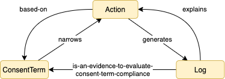
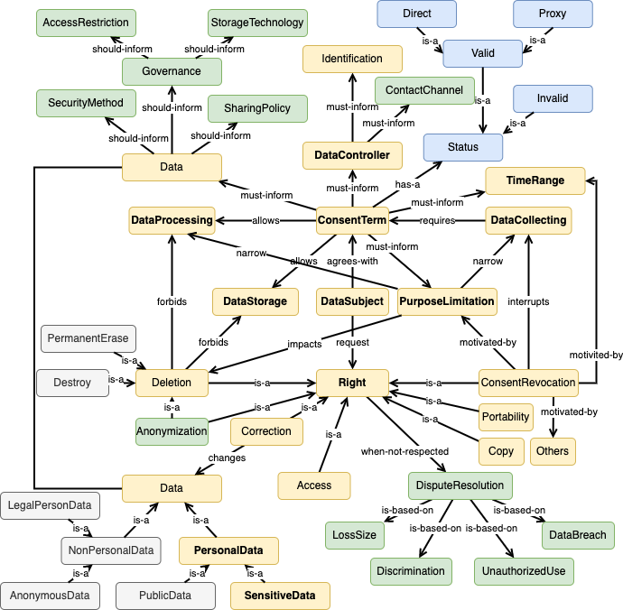

# Consent Ontology

Consent Ontology joins the PrOnto and GConsent ontologies and offers an extension inserting new entities and relationships to cover the identified gaps. Moreover, PrOnto and Gconsent are based on the GDPR, i.e., the same data protection regulation, which could be considered a limitation regarding applicability in other jurisdictions. In this sense, the extension proposed considered the Brazilian Data Protection Law (Law n. 13,709/2018 - Lei Geral de Proteção de Dados Pessoais - LGPD). 

This extension proposes three modules to mitigate the data flow informational asymmetry, as depicted in the figure below. 
The ConsentTerm module determines the consent legal basis requirements, and it narrows the data subject, controller, and processor actions. 
The Action defines the step execution based on the ConsentTerm to accomplished a specific action considering: 
    (i) the jurisdiction, to allow the scenario contextualization; 
    (ii) consent term which the action is based on; 
    (iii) time frame, 
    (iv) rights based on the jurisdiction applied, and
    (v) the deontic operator to indicate a normative expression.
Moreover, the Action generates a log of executed actions, and it should explain the action performed. Still, this can be used as evidence to evaluate the consent term compliance. 

The LGPD cases can present intersections with other laws in the Brazilian constitution, depending on the case, as depicted in the figure below. 

LGPD defines: 
 - legal basis: consent is the most popular, but there are others foreseen in the law, 
 - data protection guidelines: general guidelines, 
 - applicability: there are some situations that the LGPD cannot be applied, such as when the data is anonymized,
 - concepts: LGPD qualifies personal data, sensitive personal data, data controller, among others,
 - rights and duties: LGPD sets rights and duties for data subjects, controllers and processors.

In a detailed view, the next figure depicts the relationships between the ontology entities, and it is important to note that the "consent term" and the "right" are the central ontology points; they have many connections with other concepts as well as the entity "dispute resolution". For instance, if the purpose limitation changes, the data controller must get a new consent term from the data subject. Hence, depending on the data subject will, he/she can disagree, and it will interrupt the data collection. Still, if the data controller does not stop collecting the data subject's personal data, it will violate its rights, and fines will be applied to the data controller.

Even though the LGPD did not specify the data processing modalities, we decided to insert information regarding data security, access restriction, technologies applied, and sharing politics. These pieces of information are important to understand the environmental factors related to the scenario execution and explanation. 

Furthermore, there are 10 (ten) legal bases foreseen in the LGPD and we decided to start our study on Consent legal basis. We decided to use consent as a study object because it can be applied in most situations.

The yellow entities are those that are present in the PrOnto ontology that fits the LGPD consent legal basis.
The blue entities are those inherited from GConsent ontology.
The green entities are those which were added to fulfill the LGPD needs; however, these entities can be also applied in scenarios ruled by the GDPR without producing inconsistencies or conflicts with the remain entities.
The gray entities are those that the LGPD does not consider specifically as a concern.

For more details, we are planning to publish our work, meanwhile you can contact me.