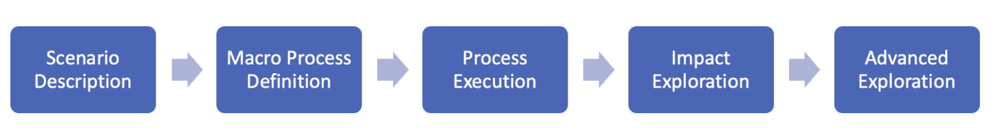
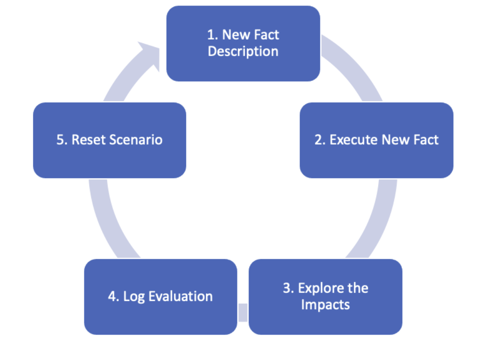

# ConFIA (Consent Framework to mitigate Informational Asymmetry)

ConFIA aims to use the [ConsentOntology](ConsentOntology.md) to develop pragmatic circumscriptions in a structured manner to evaluate computational adherence and to bridge the gap between agents, i.e., data subjects, controllers, and processors. Moreover, This framework aims to help the agents explore the circumscription at different times in the timeline, i.e., before, during, and after the consent agreement.

The scenarios were built using Jupyter Prolog (link para Jupyter Prolog) to allow agents to evaluate some possible interpretations in such an environment. Furthermore, the result would be used as evidence regarding the agreement between the parts involved. In this sense, Jupyter Prolog enables the construction of the scenarios with basic logic (Prolog) and documentation (Jupyter Notebook). The setup documentation for Jupyter Prolog is available at: [JupyterProlog](JupyterProlog.md).

To instantiate a scenario, as depicted in the figure below, ConFIA proposes five macro processes: 
- (i) Scenario Description}, which aims to identify the agents, purpose, time range, personal data, storage technology, security methods, access restrictions, third party sharing policies jurisdiction, consent compliance requirements based on the jurisdiction;
- (ii) Macro Process Definition, i.e., the step by step design to be executed by the agents; 
- (iii)Process Execution, i.e., the record of the scenario's facts seeking for regulation compliance;
- (iv) Impact Exploration, i.e., the evaluation of the impacts after the Process Execution, and
- (v) Advanced Exploration, which aims to explore other scenarios to offer evaluation regarding different possible situations.

These processes allow the agents to describe the pragmatic circumscriptions in detail and explore the understanding of the expected behavior that emerged from the agents' actions.
    

Fig.1 - ConFIA MacroProcess.

Moreover, the figure below depicts the Advanced Exploration process, which proposes the insertion of a new fact and the environment impact analysis. The generated log results from the actions performed in the scenario, representing secondary evidence of the agent's activity. At the end of each advanced sub-scenario, the new facts are removed, and the environment turns back to the basic scenario state. Hence, the advanced scenarios are independent, based on the same basic environment.

    

Fig.2 - ConFIA Advanced Exploration.

Our scenarios follows the structure presented below. First, we define the scenario context and formulate basic questions regarding the data subject's rights and how the data controller can address such questions. Then, we elaborate more complex scenarios in order to explore non-trivial situations to stress the scenario context and document the evidence. We aim to create a simulation tool that data subjects and controllers can explore the possible scenarios already developed and contribute with new perspectives. The collaborative contribution can generate a solid database for exploring LGPD compliance in many different situations.

This project starts with three different domain scenarios: [Healthcare](LGPD_Health_Scenario.ipynb), [Educational](LGPD_Educational_Scenario.ipynb), and [Open Banking](Open_Banking_Scenario.ipynb).

Moreover, this is an open-source project; thus, anyone can contribute. As much as scenarios this project has, more of the agents would have material to argue their rights.

Last but not least, this project is an outcome of a Ph.D Thesis in Brazil. The thesis link will be available after its defense.